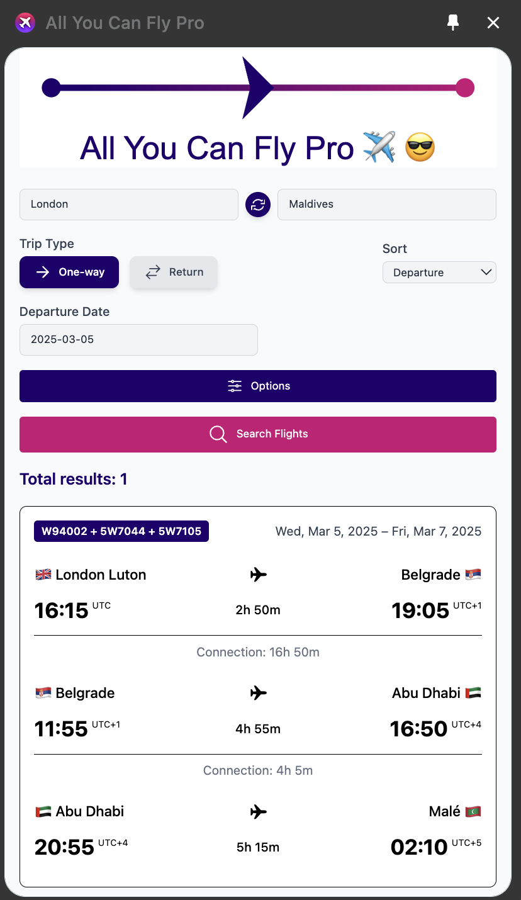

# All You Can Fly Pro ✈️ 😎

**All You Can Fly Pro** is a free Chrome extension designed specifically for Wizz Air All You Can Fly (AYCF) subscribers, enhancing your Wizzair AYCF experience by automating flight searches. Easily find direct flights and optimal connecting routes with this user-friendly Chrome extension, optimised specifically for Wizz Air AYCF subscribers.

## 🔥 What's New?

- **📍 Updated & Comprehensive Route List:** Now includes all new destinations available in the Multipass PDF, even those missing from the official website dropdown​routes.
- **⚡ Optimized & Faster Search Algorithm:**
Searches only for flights available on selected dates.
Excludes unavailable routes from search results, ensuring accurate availability​app.
- **💳 Direct Booking Integration:**
Instantly proceed to payment for selected flights directly from the search results.
No more manual searching on the airline’s website—book your flights with a single click​

## ✨ Features

- **🔍 Smart Flight Search:** Search for flights across multiple destinations with advanced filtering.
- **🔄 Swap Airports:** Quickly swap departure and destination airports with one click.
- **✈️ Multi-Airport Selection:** Choose single or multiple origin and destination airports, cities or even countries.
- **📅 Multi-Date Selection:** Choose single or multiple departure and arrival dates.
- **🛫 One-Way & Round-Trip Support:** Easily toggle between one-way and round-trip search modes.
- **🔀 Sort Flights by:** 
  - Departure Airport  
  - Departure Time  
  - Arrival Time  
  - Trip Length  
- **🔄 Connections & Stopovers:**
  - Allow flights with **one** or **two** segments.
  - Option to **allow overnight connections**.
- **⬇️ Save results to CSV file:**
  - Now you can save the chart with results to CSV-file.
  - Analyse and store data, see additional flight information, compare changes and build trends.

## ⚙️ Customization Options

- **🏡 Preferred Airport & Suggestions:** Set your default home airport, city or country for quicker searches. Choose airports from your recent searches or start typing to choose a new one.
- **⏳ Connection Time Settings:**
  - **Min Connection Time:** Adjust the minimum time between connecting flights.
  - **Max Connection Time:** Set a maximum limit to avoid long layovers.
- **🚏 Stopover Controls:**
  - Allow connections with **one transfer**.
  - Allow connections with **two transfers** (overnight transfers included).
- **🛠️ Expert Settings (Hidden by Default)**
  - **Max Requests in Row:** Configure API request limits for better performance.
  - **Requests Frequency (ms):** Set how often requests are sent.
  - **Pause Duration (sec):** Adjust delay between request batches.
  - **Cache Lifetime (hrs):** Set how long search results are stored.

## 🎛️ User Interface Enhancements

- **🌍 UI Scale Adjustment:** Customize the interface zoom level.
- **🧹 Clear Cache:** Reset stored search data for fresh results.
- **⚡ Fast Navigation:** Optimized performance for quick searches.

## Installation
⬇️ Download **All You Can fly Pro** from Chrome Web Store:
https://chromewebstore.google.com/detail/all-you-can-fly-pro/oimhdkdhblofmdebbpdfabddcnpmlhha

Then click on the extention icon and pin it to the panel.

## 🚀 Getting Started

1. Enter your **departure and destination airports**. You can search by airport, airport code, city or country.
2. Select **departure dates**. Add **return dates** to switch on round-trip journey.  You can select multiple dates.
3. Customise your **flight connections**:
    - Non-Stop only
    - One stop or fewer
    - One stop or fewer (including overnight stops)
    - Two stops or fever
4. Adjust **filters and options** in the settings:
    - Set your reffered airport
    - Change min and max connection time
    - Adjust UI scale
    - Manage cache
    - Use "Expert Settings" to change additional states only if you understand what you are doing and on your own risk!
5. Click **SEARCH** to find the best routes!

---

Developed with ❤️ to make flight searching easier and more efficient. ✈️✨  
Contribute or support this project on **[GitHub](https://github.com/deniam/AllYouCanFlyPro)**.

### Alternative Installation
1. Download and unzip the archive:
  https://github.com/deniam/AllYouCanFlyPro/releases/download/ver1_4_1/All_You_Can_Fly_Pro_1_4_1.zip
2. Open Google Chrome and navigate to chrome://extensions/.
3. Enable "Developer mode" in the top right corner.
4. Click "Load unpacked" and select the unziped application folder.
5. Click on the extention icon and pin it to the panel.

### License
This project is licensed under the MIT License. See the LICENSE file for details.

### Contributing
Contributions are welcome! Please submit pull requests for any bug fixes or enhancements.

### Disclaimer
All You Can Fly Pro is an independent project and is not affiliated with any airline or third-party service. The extension uses data from public sources and is provided as-is without any warranty.

### Privacy policy
This extension does not collect or store any personal data. All user input remains local and is not shared with third parties.